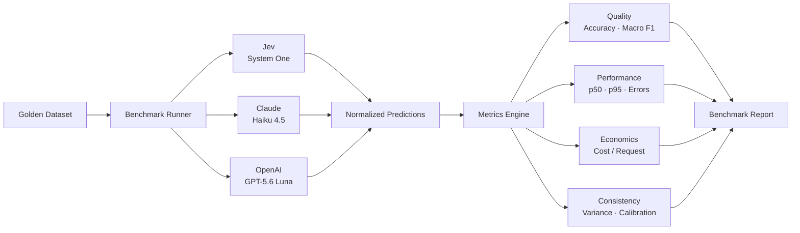
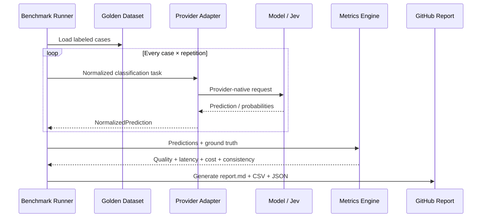

# JEV Benchmark

Open, reproducible benchmark for comparing **decision-oriented models** and **general-purpose LLMs** on structured classification tasks.

The first benchmark focuses on **user intent classification**, **sentiment classification**, and **escalation decisions** using the same labeled dataset and evaluation protocol across providers.

## Why this project

General-purpose LLMs can return structured outputs, but decision models such as Jev are optimized for classification, scoring, and probabilistic decisions. This repository measures the trade-offs rather than assuming one approach is better.

We compare providers on **quality, latency, cost, consistency, calibration, and failures**.

## Initial providers

| Provider | Default model | Role |
|---|---|---|
| Jev | System One | Decision model baseline |
| Anthropic | Claude Haiku 4.5 | Low-cost general-purpose LLM |
| OpenAI | GPT-5.6 Luna | Low-cost general-purpose LLM |

Providers are adapters. Adding another model should not require changing the benchmark core.

## Architecture



GitHub renders Mermaid directly in Markdown, so the architecture stays versioned as text and is visible without external images.

## Results

Every benchmark run writes machine-readable results plus a Markdown report:

```text
results/
└── <run-id>/
    ├── predictions.csv
    ├── summary.json
    └── report.md
```

Open `report.md` directly on GitHub to inspect the benchmark without downloading a dashboard or running a notebook.

A report is designed to contain:

- benchmark metadata and exact model IDs;
- Accuracy and Macro F1;
- latency p50 / p95;
- estimated cost;
- parse/error rate;
- consistency across repeated runs;
- confusion matrices rendered as Markdown tables;
- links to raw predictions for reproducibility.

For stable public releases, curated reports can be committed under `results/published/<version>/`. This keeps headline benchmark results reviewable and version-controlled while raw CI artifacts remain attached to workflow runs.

## Quick start

```bash
git clone https://github.com/renanlalier/jev-benchmark.git
cd jev-benchmark

python -m venv .venv

# Linux / macOS
source .venv/bin/activate

# Windows PowerShell
# .venv\Scripts\Activate.ps1

pip install -r requirements.txt
cp .env.example .env
```

Add only the API keys for the providers you want to benchmark.

```bash
jev-bench run --providers jev anthropic openai
```

Run a single provider:

```bash
jev-bench run --providers jev
```

Measure run-to-run consistency:

```bash
jev-bench run --providers jev anthropic openai --repetitions 10
```

For contributors:

```bash
pip install -r requirements-dev.txt
pytest
```

## Benchmark flow



## Dataset format

The initial dataset is intentionally human-readable and versioned in Git:

```csv
id,text,expected_intent,expected_sentiment,expected_escalation
1,"I spent 50 dollars at the supermarket",FINANCIAL_TRANSACTION,NEUTRAL,false
2,"Remind me tomorrow at 9 to call the doctor",REMINDER,NEUTRAL,false
3,"This is the third time this failed",GENERAL_CHAT,FRUSTRATED,true
```

The repository ships with a small smoke-test dataset. A larger benchmark dataset should use explicit annotation guidelines, independent review, and dataset versioning before headline comparisons are published.

## Fairness principles

1. Same taxonomy and dataset for every provider.
2. Deterministic parsing into one normalized prediction contract.
3. Provider-specific prompting is allowed only when required to express the same task correctly.
4. Raw outputs and benchmark configuration are persisted for reproducibility.
5. Published results record model IDs, date, dataset version, repetitions, and pricing assumptions.
6. Confidence is compared only when semantically meaningful; synthetic LLM confidence is not treated as equivalent to provider-native probabilities.

See [`docs/methodology.md`](docs/methodology.md).

## Project status

This repository is an early benchmark harness. The goal is to establish a transparent, reproducible protocol before publishing large comparative claims.

## Contributing

Contributions are welcome: providers, datasets, metrics, reproducibility improvements, and independent benchmark runs.

Please read [`CONTRIBUTING.md`](CONTRIBUTING.md) before opening a pull request.

## License

MIT. See [`LICENSE`](LICENSE).
