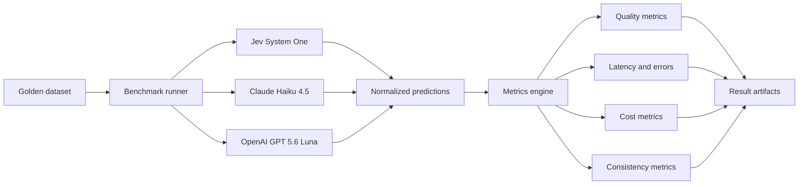
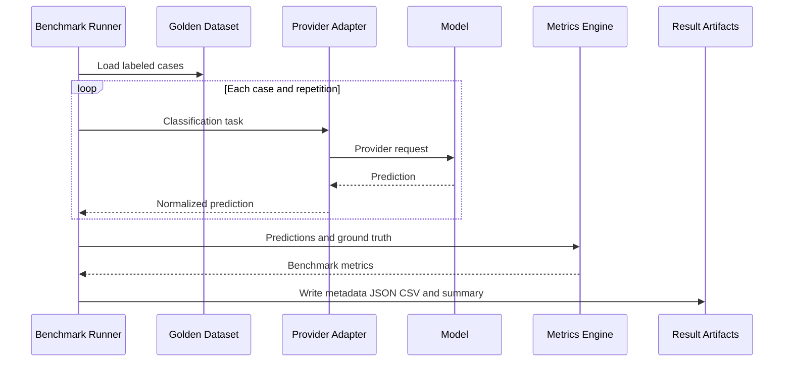

# JEV Benchmark

Open, reproducible benchmark for comparing **decision-oriented models** and **general-purpose LLMs** on structured classification tasks.

The first benchmark focuses on **user intent classification**, **sentiment classification**, and **escalation decisions** using the same labeled dataset and evaluation protocol across providers.

## Why this project

General-purpose LLMs can return structured outputs, but decision models such as Jev are optimized for classification, scoring, and probabilistic decisions. This repository measures the trade-offs rather than assuming one approach is better.

We compare providers on **quality, latency, cost, consistency, calibration, and failures**.

## Initial providers

| Provider | Default model | Role |
|---|---|---|
| Jev | System One | Decision model baseline |
| Anthropic | Claude Haiku 4.5 | Low-cost general-purpose LLM |
| OpenAI | GPT-5.6 Luna | Low-cost general-purpose LLM |

Providers are adapters. Adding another model should not require changing the benchmark core.

## Architecture



GitHub renders Mermaid directly in Markdown, so the architecture stays versioned as text and is visible without external images.

## Results

Every benchmark run writes machine-readable results:

```text
results/
└── <task>/
    └── <run-id>/
        ├── metadata.json
        ├── predictions.csv
        └── summary.json
```

`metadata.json` records the task, dataset hash, providers, repetition count, timestamp, and commit. `predictions.csv` contains one row per provider prediction. `summary.json` contains aggregate metrics for each provider.

For stable public releases, curated result files can be committed under `results/published/<version>/`. This keeps benchmark outputs reviewable and version-controlled while raw CI artifacts remain attached to workflow runs.

## Quick start

```bash
git clone https://github.com/renanlalier/jev-benchmark.git
cd jev-benchmark

python -m venv .venv

# Linux / macOS
source .venv/bin/activate

# Windows PowerShell
# .venv\Scripts\Activate.ps1

pip install -r requirements.txt
cp .env.example .env
```

Add only the API keys for the providers you want to benchmark.

```bash
jev-bench run
```

Run customer-support triage:

```bash
jev-bench run --task customer-support
```

Run a single provider:

```bash
jev-bench run --provider jev
```

Measure run-to-run consistency (use only when the provider cache is disabled or documented):

```bash
jev-bench run --repetitions 10
```

For contributors:

```bash
pip install -r requirements-dev.txt
pytest
```

## Benchmark flow



## Dataset format

The initial dataset is intentionally human-readable and versioned in Git:

```csv
id,text,expected_intent,expected_sentiment,expected_escalation
1,"I spent 50 dollars at the supermarket",FINANCIAL_TRANSACTION,NEUTRAL,false
2,"Remind me tomorrow at 9 to call the doctor",REMINDER,NEUTRAL,false
3,"This is the third time this failed",GENERAL_CHAT,FRUSTRATED,true
```

The repository ships with a 100-case assistant-classification dataset. A larger benchmark dataset should use explicit annotation guidelines, independent review, and dataset versioning before headline comparisons are published.

## Fairness principles

1. Same taxonomy and dataset for every provider.
2. Deterministic parsing into one normalized prediction contract.
3. Provider-specific prompting is allowed only when required to express the same task correctly.
4. Dataset hashes and benchmark configuration are persisted for reproducibility.
5. Published results record model IDs, date, dataset version, repetitions, and pricing assumptions.
6. Confidence is compared only when semantically meaningful; synthetic LLM confidence is not treated as equivalent to provider-native probabilities.

Run customer-support triage with `jev-bench run --task customer-support`. See [`docs/methodology.md`](docs/methodology.md).

## Project status

This repository is an early benchmark harness. The goal is to establish a transparent, reproducible protocol before publishing large comparative claims.

## Contributing

Contributions are welcome: providers, datasets, metrics, reproducibility improvements, and independent benchmark runs.

Please read [`CONTRIBUTING.md`](CONTRIBUTING.md) before opening a pull request.

## License

MIT. See [`LICENSE`](LICENSE).
